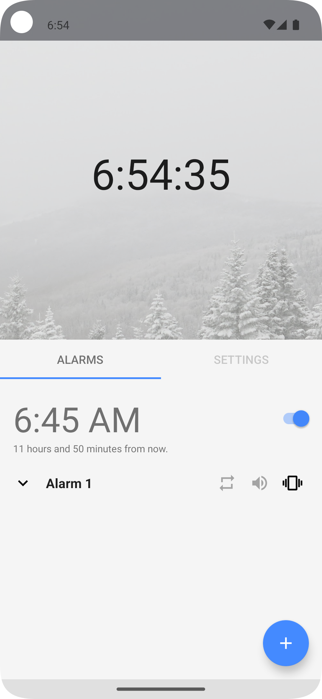
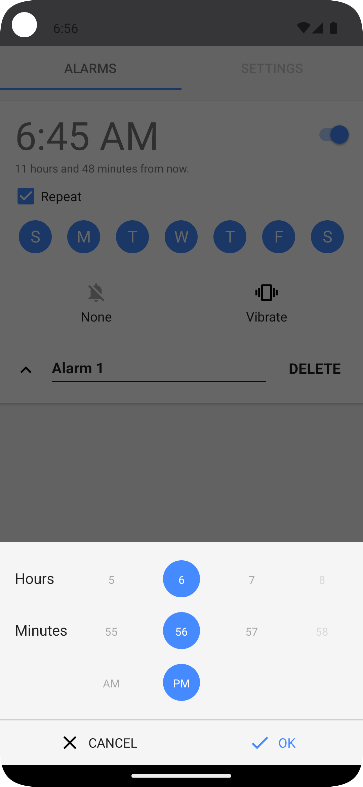
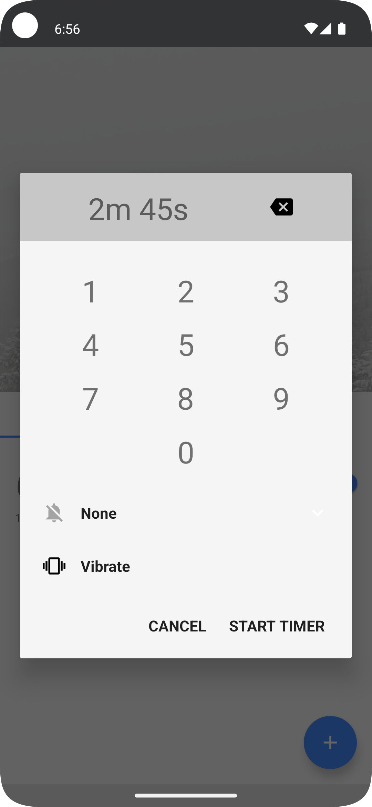
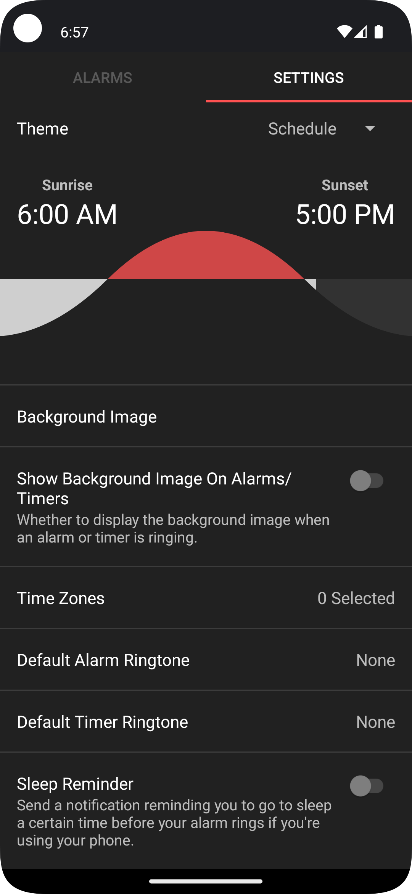

<div align="center">
  <h1>⏰ Alarmio</h1>
  <p>A simple, quick, and intuitive alarm clock with many useful features.</p>
  
  
  <br>
  <a href="https://github.com/meenbeese/Alarmio/actions/workflows/android.yml">
    
  </a>
  <a href="https://liberapay.com/meenbeese/">
    
  </a>
</div>

## 🌄 Screenshots    

[](./.github/images/home.png)
[](./.github/images/alarms.png)
[](./.github/images/timers.png)
[](./.github/images/themes.png)

## ⭐ Features

- Custom backgrounds & ringtones,
- No unnecessary permissions,
- Dark, Light, Amoled themes
- Granular controls everywhere
- Unique, minimal, efficient design,
- Custom audio files & backgrounds
- Portrait and landscape orientation
- Countless default ringtones

## ⚙️ Permissions

- `SET_ALARM`, `VIBRATE`, `WAKE_LOCK`: necessary for the core functionality of the app
- `INTERNET`: obtaining a set of sunrise/sunset times (only stored locally) and fetching graphical assets and some of the information in the about page
- `RECEIVE_BOOT_COMPLETED`: re-scheduling alarms on startup
- `READ_EXTERNAL_STORAGE`: setting custom background / header images in the settings
- `FOREGROUND_SERVICE`: notifying you to sleep - see the "Sleep Reminder" option in the settings
- `REQUEST_IGNORE_BATTERY_OPTIMIZATIONS`: please see [dontkillmyapp.com](https://dontkillmyapp.com/)

## 📲 Installation

[](https://f-droid.org/packages/me.jfenn.Alarmio/)
[]((../../releases/))

## 📝 How to Contribute

Alarmio is a user-driven project. All contributors, including myself, are motivated by personal needs and ideals. We don’t have a professional support line or paid development team. Any contribution, regardless of size or format, is welcome. **If you need help or feedback, feel free to reach out.**

- **🖥️ Development:** Help by fixing bugs, implementing features, or researching issues. Review CONTRIBUTING.md, then open a PR for review.
- **🍥 Designing:** Suggestions to improve interfaces, including accessibility and usability, are welcome.
- **🤝 Helping users:** Respond to issues and identify duplicates to reduce workload on maintainers.
- **📂 Filing issues:** Report bugs and edge cases with relevant info (device name, Android version, Alarmio version, description). Screen recordings and logcat info are helpful.
- **🌍 Localization:** If Alarmio does not support your language, consider translating it! In-app text is in strings.xml. Copy this file to ../values-{lang}/strings.xml when translated.
- **📄 Documentation:** Write guides and explanations about Alarmio, its usage, and how to contribute. This can include README updates, user tutorials, or adding comments to undocumented functions.

### ✅ Other ways of support

Not everyone has the time or technical knowledge to help out with many of the above - we understand that. With this in mind, here are a few other ways to help us out that don't require as much time or dedication.

- **💈 Advertising:** Spread the word! If you like what we're doing here, getting more people involved is the best way to help improve it. Suggestions include: posting on social media... writing a blog post... yeah, right, you get the idea.
- **💵 Donations:** I've invested a lot of time into this app - as have many of its contributors. Many of us have paying jobs, difficult classes, or otherwise important life occurrences that prevent us from putting all our time into software.
- **📢 Politics:** Yep, you're reading this right. Free software is, in fact, a very political thing - and I'd like to think we're taking the right approach. If you can, consider supporting FOSS applications and services over proprietary ones.

## ✏️ Acknowledgements

I would like to give a huge thanks to all of Alarmio's [contributors](https://github.com/fennifith/Alarmio/graphs/contributors), the developers that write the software we depend on, and the users that support our goal. Also, props to [F-Droid](https://f-droid.org/en/about/) for maintaining the free software repository that distributes our app and many others like it.

I have received a lot of thanks from various people for the time I've put into this, and that thought helps me get up in the morning. If someone fixes a bug you encountered, helps you out in an issue, or implements a feature you enjoy, please consider sending them a tip or a thank-you note to let them know that you appreciate their time :)

## 🏗️ Building From Source

You need Android Studio to build this App.
After Installing Android Studio, select `Project` from `Version Control` and paste the link of this repository.
Navigate to `Build > APK > Create New Keystore > Enter the password` and wait for the build to finish.

## 📝 License

```
Copyright (C) 2024 Meenbeese

Licensed under the Apache License, Version 2.0 (the "License");
you may not use this file except in compliance with the License.
You may obtain a copy of the License at:

https://www.apache.org/licenses/LICENSE-2.0

Unless required by applicable law or agreed to in writing,
software distributed under the License is distributed on an "AS IS" BASIS,
WITHOUT WARRANTIES OR CONDITIONS OF ANY KIND, either express or implied.
See the License for the specific language governing permissions and limitations under the License.
```
