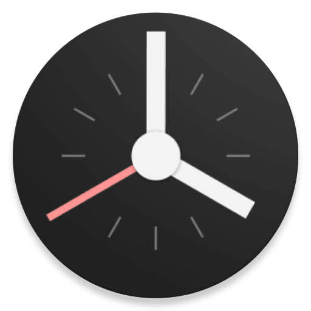
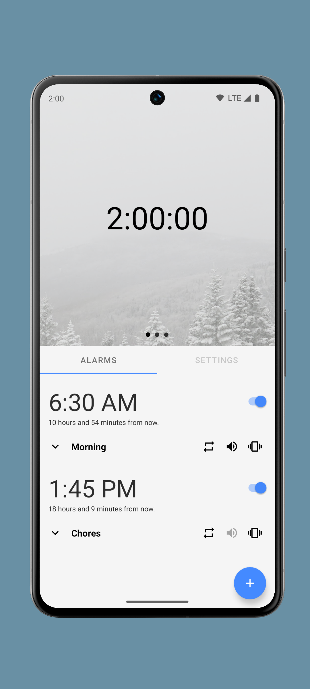
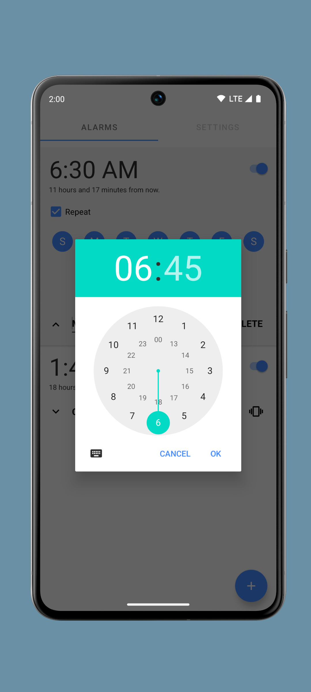
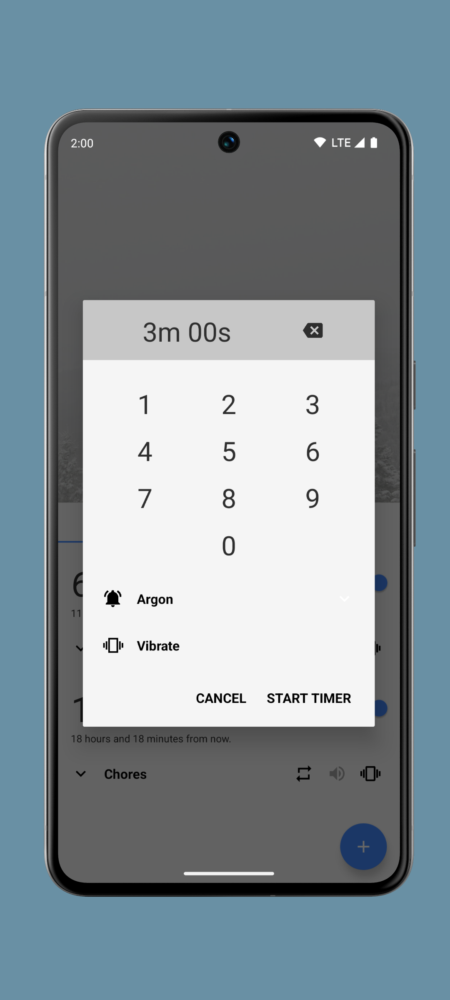
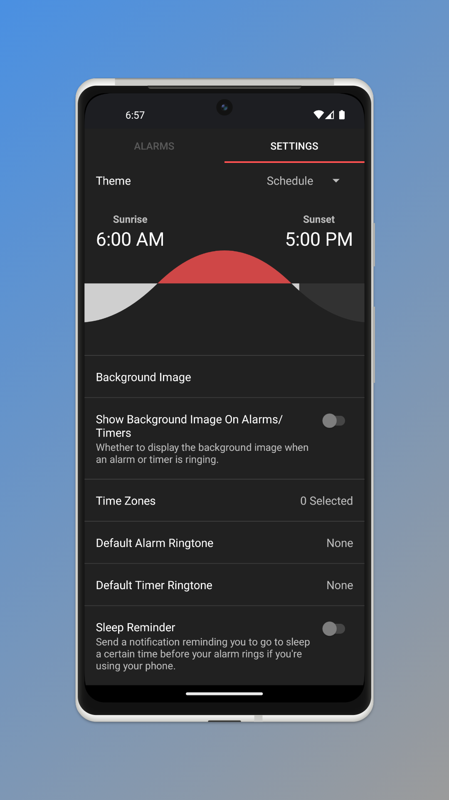

<div align="center">
  
  <h1>Chronos</h1>
  <p>A simple, quick, and intuitive alarm clock with many useful features.</p>
  
  
  <br>
  <a href="https://github.com/meenbeese/Chronos/actions/workflows/android.yml">
    
  </a>
  <a href="https://liberapay.com/meenbeese/">
    
  </a>
</div>

## 🌄 Screenshots

<div align="center">
       
</div>

## ⭐ Features

- Custom backgrounds & ringtones
- No unnecessary permissions
- Dark, Light, AMOLED themes
- Granular controls everywhere
- Unique, minimal, efficient design
- Portrait and landscape orientation
- Countless default ringtones

## 📲 Installation

<a href="https://apt.izzysoft.de/fdroid/index/apk/com.meenbeese.chronos"></a>
<a href="https://github.com/meenbeese/Chronos/releases/latest"></a>
<a href="https://apps.obtainium.imranr.dev/redirect?r=obtainium://add/https://github.com/meenbeese/Chronos"></a>

## ⚙️ Permissions

- `SET_ALARM`, `VIBRATE`, `WAKE_LOCK`: necessary for the core functionality of the app
- `INTERNET`: fetching some of the graphical assets in the about page
- `RECEIVE_BOOT_COMPLETED`: automatically re-scheduling alarms on startup
- `READ_MEDIA_AUDIO`: setting custom ringtones for the alarms or timers
- `READ_MEDIA_IMAGES`: setting custom background / header images in the settings
- `FOREGROUND_SERVICE`: notifying you to sleep - see the "Sleep Reminder" option in the settings
- `REQUEST_IGNORE_BATTERY_OPTIMIZATIONS`: please see [dontkillmyapp.com](https://dontkillmyapp.com/)

## 📝 Contribute to Chronos

Chronos is a user-driven project. We welcome any contribution, big or small.

- **Development:** Fix bugs, implement features, or research issues. Open a PR for review.
- **Design:** Improve interfaces, including accessibility and usability.
- **User Support:** Respond to issues and identify duplicates.
- **Issue Reporting:** Report bugs and edge cases with relevant info.
- **Localization:** Translate Chronos if it doesn't support your language.
- **Documentation:** Write guides, explanations, README updates, or documentation.

### ✅ Other Support Methods

If you can't contribute directly, consider these options:

- **Advertising:** Spread the word about Chronos.
- **Donations:** [Support us](https://liberapay.com/meenbeese/) financially if you can.
- **Advocacy:** Support FOSS services over closed ones.

## ✏️ Acknowledgements

Thanks to Chronos' contributors, the developers of our dependencies, and our users. Please support them with tips or thank-you notes if you like their work :)

## 🏗️ Building From Source

1. First you need to get the source code of Chronos.
```sh
git clone https://github.com/meenbeese/Chronos.git
```
2. Open the project in [Android Studio](https://developer.android.com/studio).
3. When you click the `▶ Run` button, it will be built automatically.
4. Launch Chronos.

## 📝 License

```
Copyright (C) 2024 Meenbeese

Licensed under the Apache License, Version 2.0 (the "License");
you may not use this file except in compliance with the License.
You may obtain a copy of the License at:

https://www.apache.org/licenses/LICENSE-2.0

Unless required by applicable law or agreed to in writing,
software distributed under the License is distributed on an "AS IS" BASIS,
WITHOUT WARRANTIES OR CONDITIONS OF ANY KIND, either express or implied.
See the License for the specific language governing permissions and limitations under the License.
```
